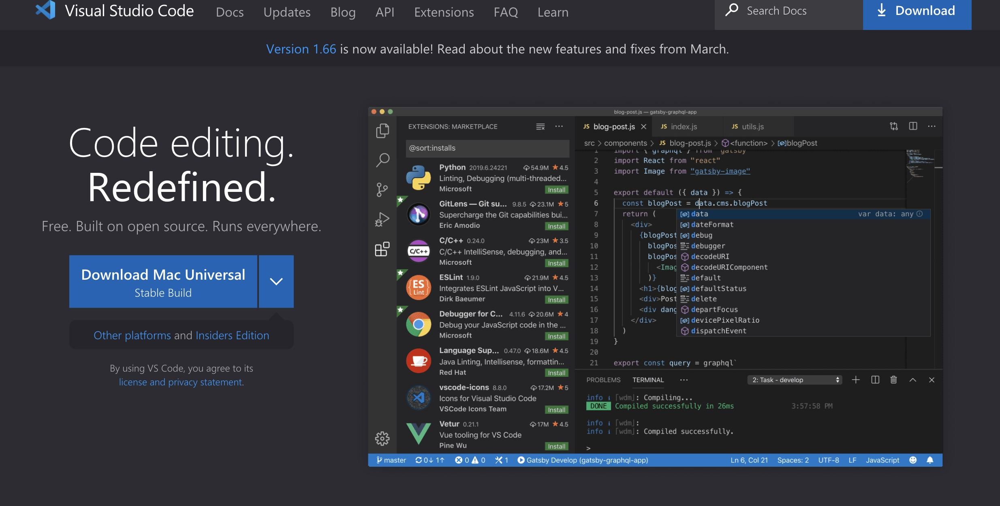
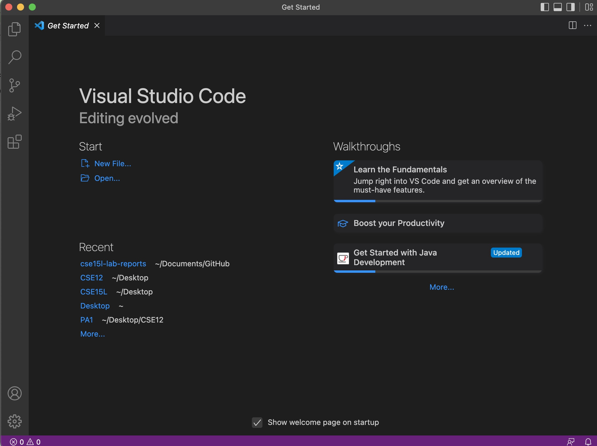
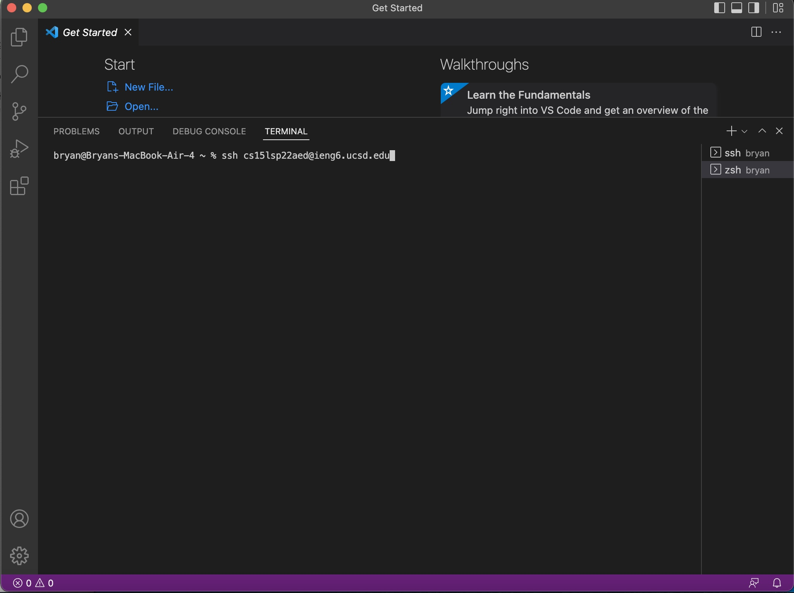
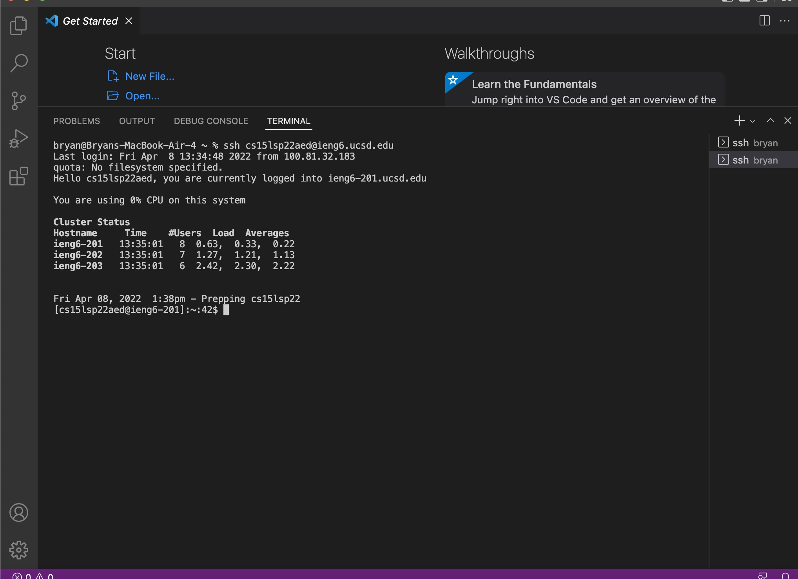
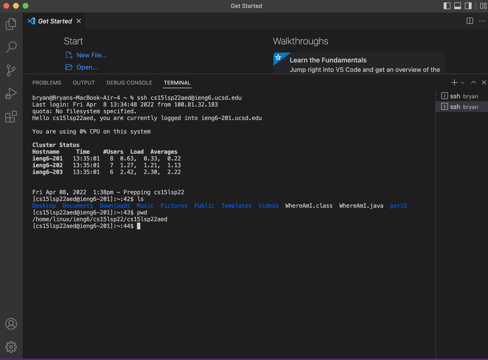
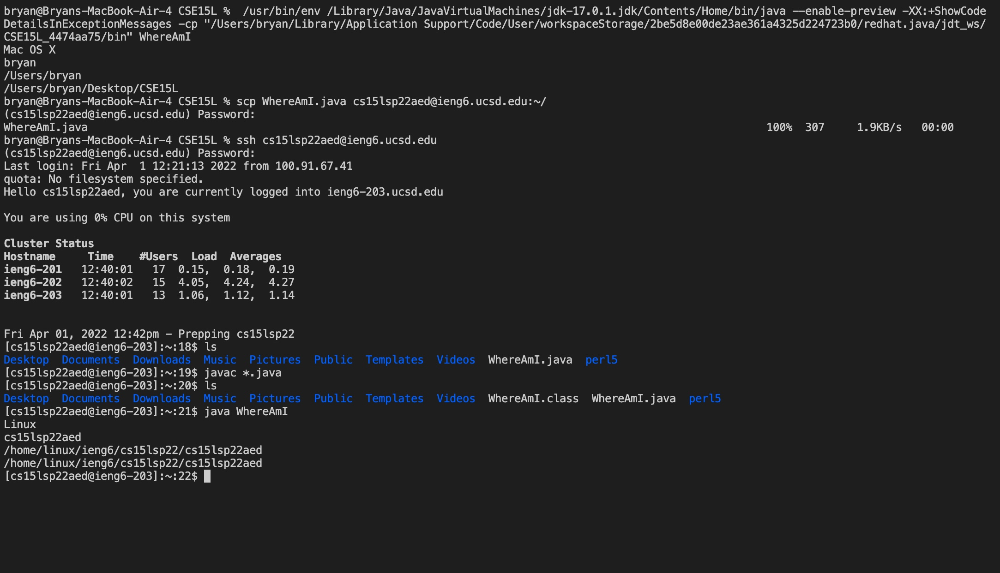
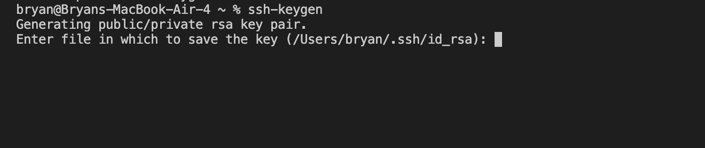
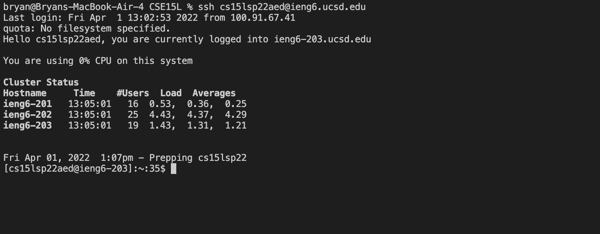
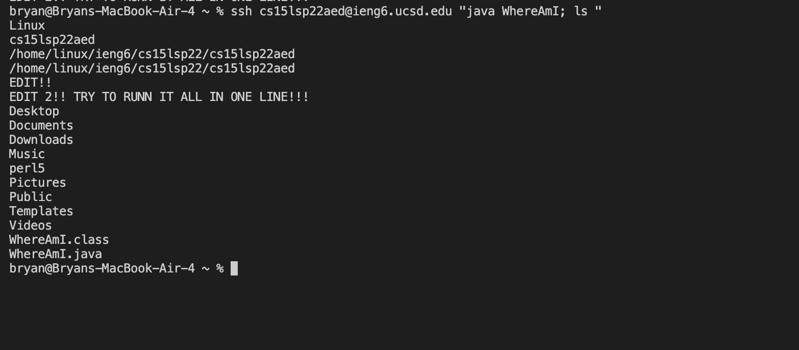

# Lab Report 1 - remote access

## **Installing VScode**

Begin by installing Visual Studio Code that is suite for your operating system. Mine is on MAC OS so I will download that one.

After opening VS Code it should look like this

## **Remotely Connecting**

Open a new termial, on mac this will be done on the menu located on the top of the screen. Type the command `ssh` followed by your username, mine is "cs15lsp22aed@ieng6.ucsd.edu"

You will be prompted by a password entry. The password will appear to be blank but the system is only doing this to prevent hacking. 

## **Trying Some Commands**

There are commands that can be run from the terminal. `cd`, `ls`,  `pwd`, `mkdir` and `rm` are some. 
The [link](https://en.wikipedia.org/wiki/List_of_Unix_commands) provides a comprehensive list of UNIX commands.

## **Moving Files with `scp`**

It is possible to move files from one computer to the remote server by using the `scp` command. The command followed by the file to be moved and then account id ending with `:~/`. 

Example: `scp WhereAmI.java cse15lsp22aed@ieng6.ucsd.edu:~/`

If successful there will be a line with the file and some numbers to the right of it. These numbers represent the data transfer time and size.

## **Setting an SSH Key**

By using the command `ssh-keygen` and when prompted for the location of the file, type: 

`/Users/<user-name>/.ssh/id_rsa` .

When prompted for a password make sure to not put anything and press enter.  Use the following command to copy the public key into the server. 

Make sure to use your username and account number.

Example: 

`scp /Users/bryan/.ssh/id_rsa.pub cs15lsp22aed@ieng6.ucsd.edu:~/.ssh/authorized_keys`

If done correctly, we can login without entering a password.

## **Optimizing Remote Running**

We can combine inputs into one line for more effecient commands. Here I combine the login to ssh, running a file called WhereAmI.java, and printed the directory. 

Example: 

`ssh cs15lsp22aed@ieng6.ucsd.edu "java WhereAmI; ls"`

[back](https://bchoucsd.github.io/cse15l-lab-reports/)

