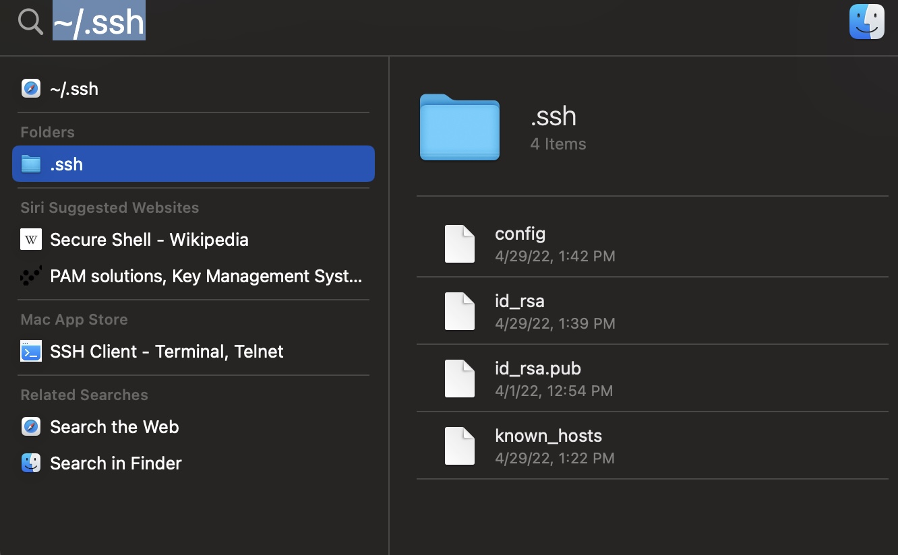
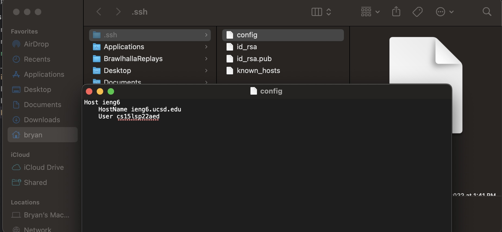
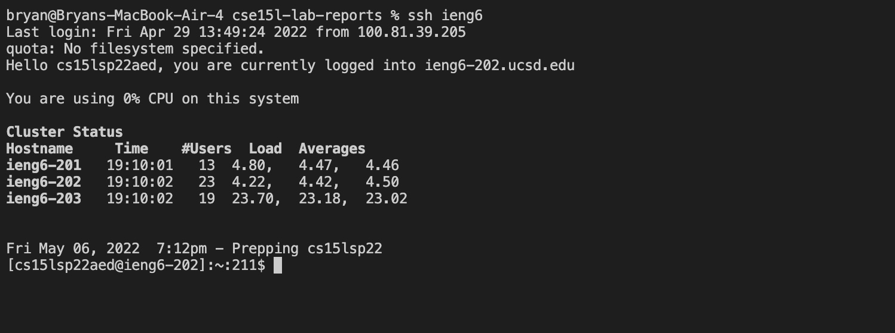
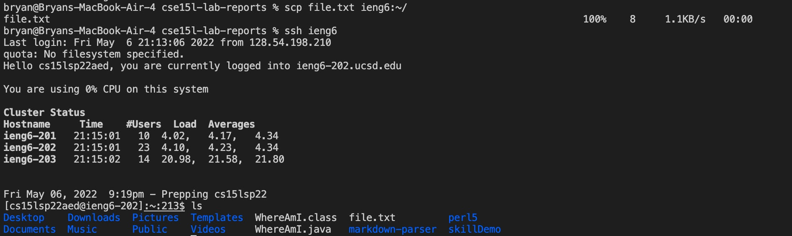

# Lab report 3

## Streamlining ssh Configuration
* We can edit the configuration file to save the user from typing
out the entire ssh login. First find the ssh folder with the path `~/.ssh`


* Open the config file and add the following text, the name after the host can be anything used to login into the account.
```
Host ieng6
    HostName ieng6.ucsd.edu
    User cs15lsp22aed
```

* If successful we should be able to login the ssh with just 
`ssh ieng6`

* Here is a copying a file called "file.txt" into the remote account using the new alias



## Setup Github Acess from ieng6
