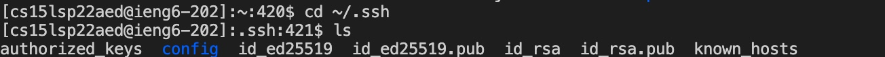
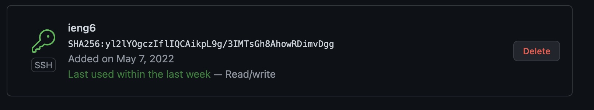
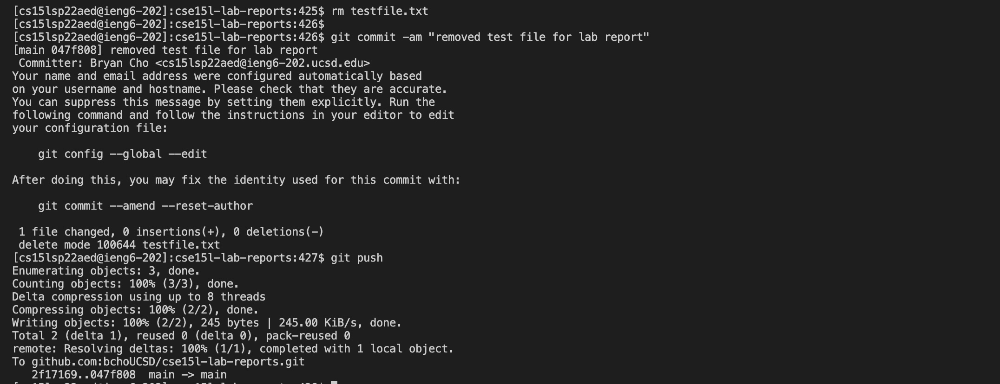
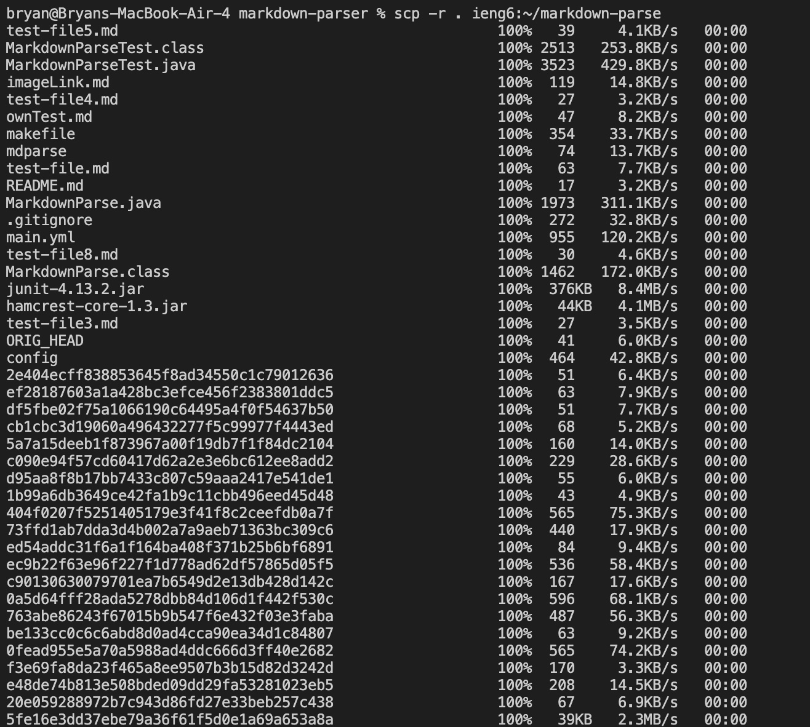
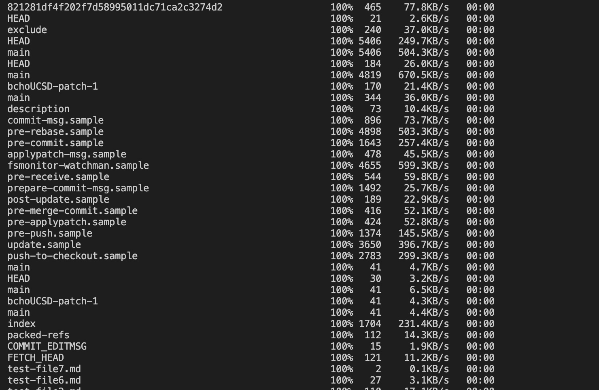
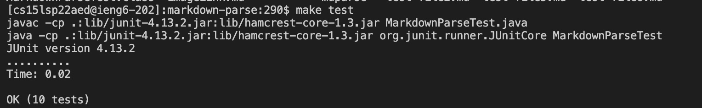
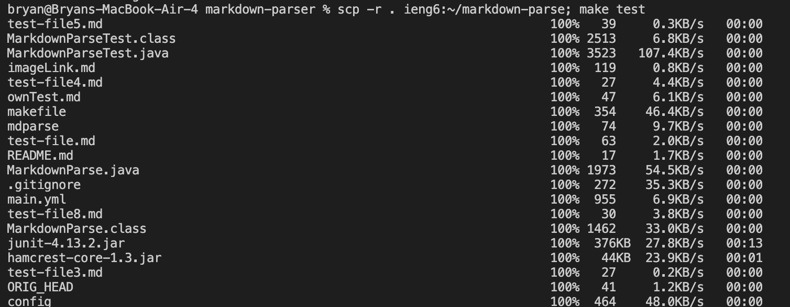
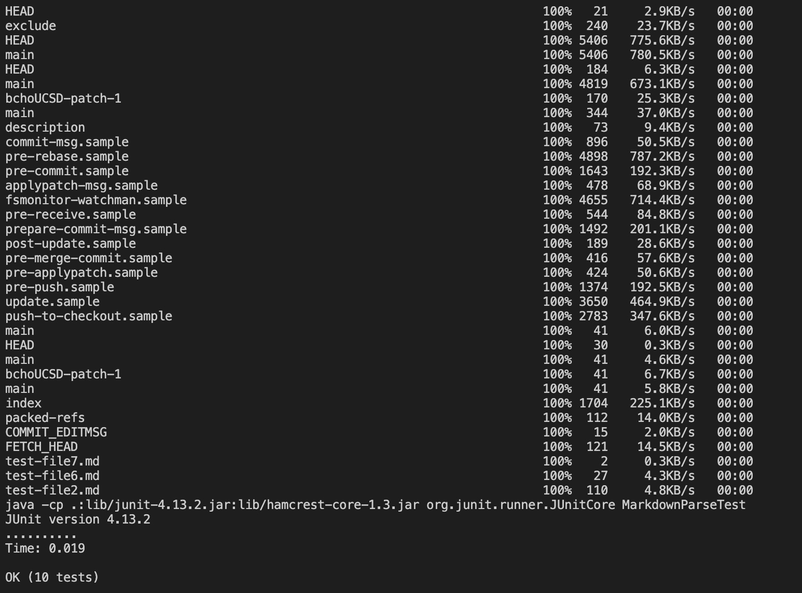

# Lab report 3

## Streamlining ssh Configuration
* We can edit the configuration file to save the user from typing
out the entire ssh login. First find the ssh folder with the path `~/.ssh`


* Open the config file and add the following text, the name after the host can be anything used to login into the account.
```
Host ieng6
    HostName ieng6.ucsd.edu
    User cs15lsp22aed
```

* If successful we should be able to login the ssh with just 
`ssh ieng6`

* Here is a copying a file called "file.txt" into the remote account using the new alias


## Setup Github Acess from ieng6
* I first made a public key on the my remote account with the command `ssh-keygen -t ed25519 -C "bcho@ucsd.edu`
* make sure to open the ssh agent up ```eval `ssh-agent` ``` and make sure to add your key `ssh-add ~/.ssh/keyname` replacing keyname with your key.
* This is where my public and private key are stored the `id_ed25519.pub` and `id_ed25519`.

* In order to run git commands from remote account I need to  add the public key into my github.

* Now I can run git commands on the remote account. I first cloned the repo using the ssh link from github, and then added a file called `testfile.txt`. I then removed the file and made a commit message. 

[Here](https://github.com/bchoUCSD/cse15l-lab-reports/commit/047f8080fd1a0184168129af5a300b99c08b1824) is the resulting commit of the change I made on the remote account.


## Copy whole direcotires with `scp -r`
* we are able to copy entire directories using the `scp` with the `-r` which is means to repeat the call recursively. This allows for a simple command to be extremely powerful.
* This is just a copy to the remote account 



Upon logging into the remote account I am able to call the tests on the remote server using `make test`


Now combining the previous two commands I copy and run the tests all in one line.




[back](https://bchoucsd.github.io/cse15l-lab-reports/)