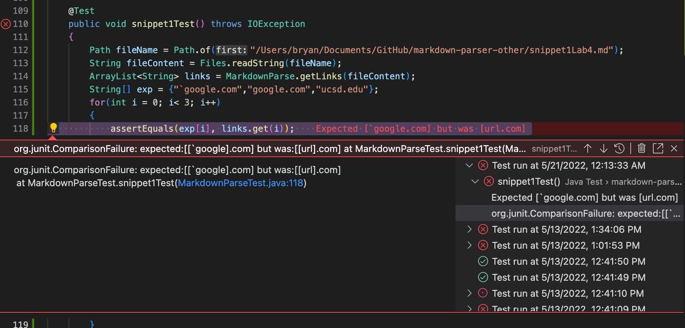
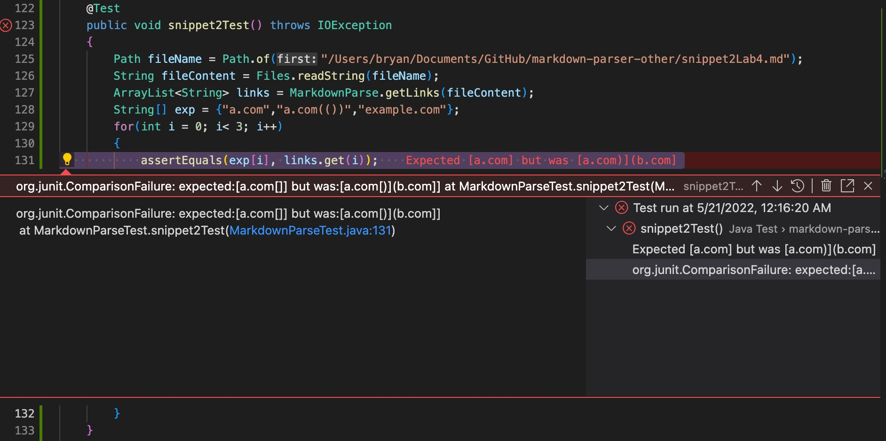
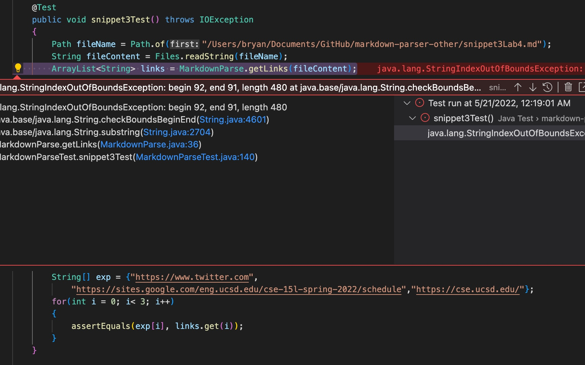
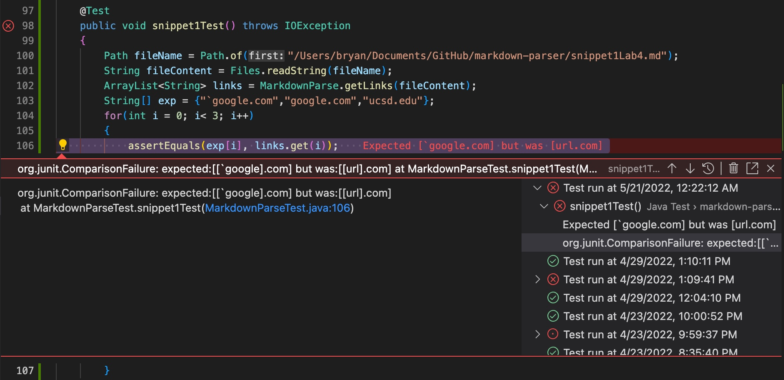
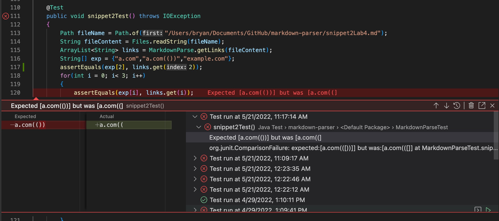
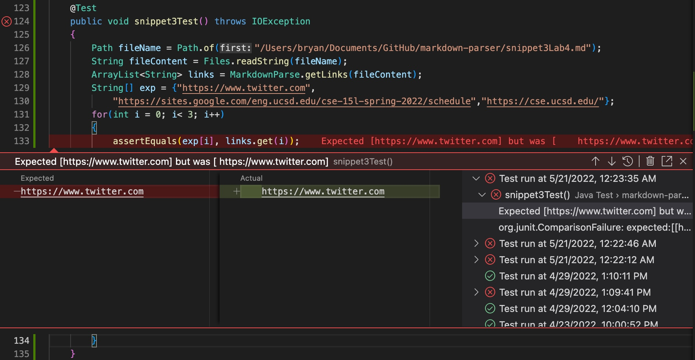
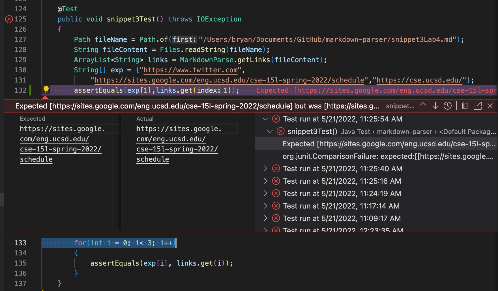

# Lab Report 4


Reviewed Repository: [Link](https://github.com/KristinEbu/markdown-parser)

My Repository: [Link](https://github.com/bchoUCSD/markdown-parser)

## Reviewed Implementation

1. **First Snippet**

- By utilizing the VScode preview feature for markdown files, I was able to see that the links are ``` `google.com ```, `google.com`, and `ucsd.edu`. I made the Junit test check for if the strings inside the ArrayList were the same as the expected. For the first snippet the code did not pass because it read the first line as a link when it just looked like a link.

2. **Second Snippet**

- By utillizing the VScode preview feature for markdown files, I was able to see that the links are `a.com`, `a.com(())`, and `example.com`. I made the Junit test check for if the strings inside the ArrayList were the same as the expected. The test failed because the code checked for the last paranthesis which in this case added an extra link, that was not part of the link wanted. 

3. **Third Snippet**

- By utillizing the VScode preview feature for markdown files, I was able to see that the links are ` https://www.twitter.com `, `https://sites.google.com/eng.ucsd.edu/cse-15l-spring-2022/schedule`, and `https://cse.ucsd.edu/`. I made the Junit test check for if the strings inside the ArrayList were the same as the expected. The test failed because of an index out of bounds error that occurs when the substring is called with the starting index that is bigger than the ending one.

## Own Implementation

1. **First Snippet**

- The link's were ``` `google.com ```, `google.com`, and `ucsd.edu`. I made the Junit test check if the strings inside the ArrayList were the same as the expected. The test failed because my code read the first line as a link when it only looked like a link.

    **Changes**
- I think that it could be possible to make a code change to be able to detect code with backticks in under 10 lines. I think that the implementation would involve checking if there is a backtick and if there is one, it would not count any of the characters that are behind the last backtick and after the first one. 

2. **Second Snippet**

- The expected links were `a.com`, `a.com(())`, and `example.com`. I made the Junit test check if the strings inside the ArrayList were the same as the expected. The test failed because the first link that was read did not contain the extra parantheses that were in the link.

    **Changes**
- I think that it would be possible to make a under 10 line change that would detect paratheses, brackets, and escape brackets because my code already can pass the last part of the snippet which contains an extra set of brackets inside the link. I just have to make it so that the code will only count the last valid parantheses in the link to copy. 

3. **Third Snippet**

The expected links were ` https://www.twitter.com `, `https://sites.google.com/eng.ucsd.edu/cse-15l-spring-2022/schedule`, and `https://cse.ucsd.edu/`. I made the Junit test check the strings in the ArrayList and compare it with the expected strings. The test failed because in the first case it failed to take out the spaces in the link and in the second case, it failed to have the same link, as the expected, even though they look identical. 


    **Changes**
- I think that this change will take more than 10 lines of code because I have to fix the spacing issue, the correct link issue. In order for me to do this I think that I will need to find when the link ends an cut out all the extra spacing. I think that I also have to consider when the line ends and if the link will still be a valid link. 

[back](https://bchoucsd.github.io/cse15l-lab-reports/)