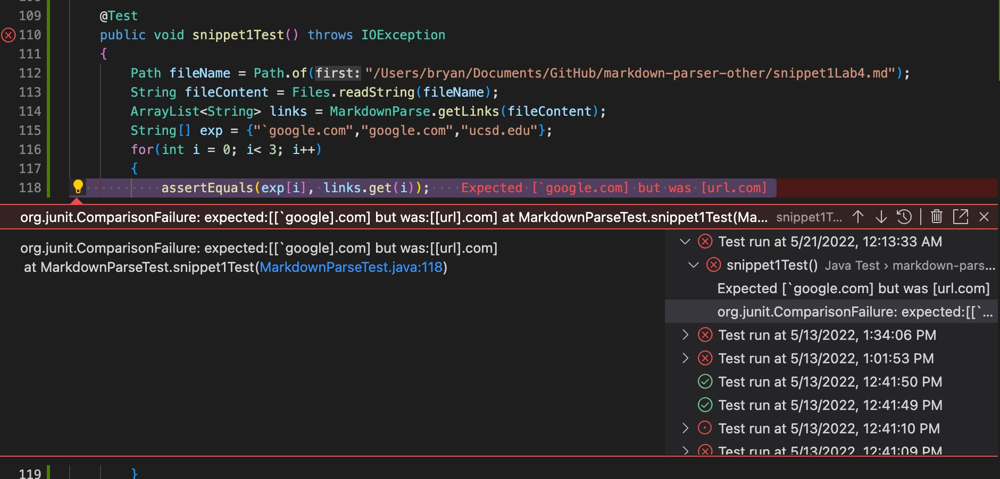
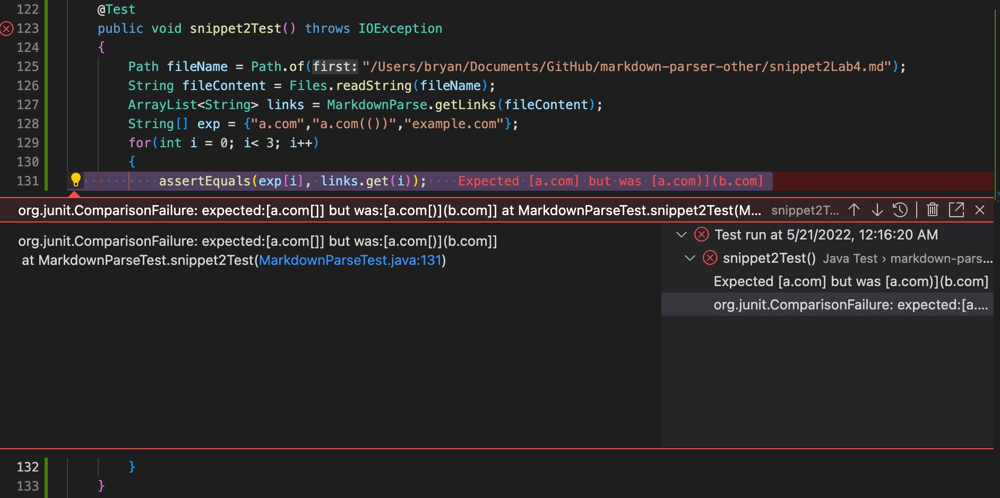
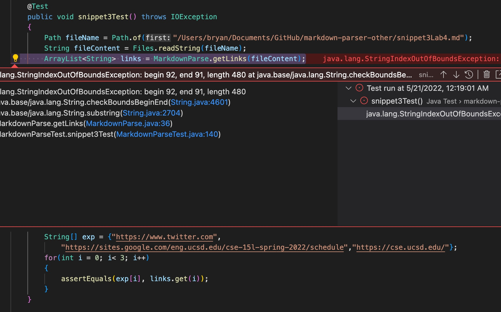

# Lab Report 4


Reviewed Repository: [Link](https://github.com/KristinEbu/markdown-parser)

My Repository: [Link](https://github.com/bchoUCSD/markdown-parser)

## Reviewed Implementation

1. **First Snippet**

- By utilizing the VScode preview feature for markdown files, I was able to see that the links are ``` `google.com ```, `google.com`, and `ucsd.edu`. I made the Junit test check for if the strings inside the ArrayList were the same as the expected. For the first snippet the code did not pass because it read the first line as a link when it just looked like a link.

2. **Second Snippet**

- By utillizing the VScode preview feature for markdown files, I was able to see that the links are `a.com`, `a.com(())`, and `example.com`. I made the Junit test check for if the strings inside the ArrayList were the same as the expected. The test failed because the code checked for the last paranthesis which in this case added an extra link, that was not part of the link wanted. 

3. **Third Snippet**

- By utillizing the VScode preview feature for markdown files, I was able to see that the links are ` https://www.twitter.com `, `https://sites.google.com/eng.ucsd.edu/cse-15l-spring-2022/schedule`, and `https://cse.ucsd.edu/`. I made the Junit test check for if the strings inside the ArrayList were the same as the expected. The test failed because of an index out of bounds error that occurs when the substring is called with the starting index that is bigger than the ending one.

## Own Implementation

1. **First Snippet**


2. **Second Snippet**


3. **Third Snippet**


[back](https://bchoucsd.github.io/cse15l-lab-reports/)