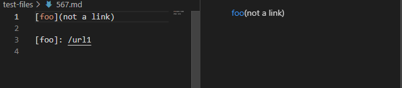

# Lab Report 5

* The two files that resulted in differences when using `vimdiff`. The file on the left is my own implementation and the one on the right is the given implementation.

 

 The two files that I found were test files [567](https://github.com/nidhidhamnani/markdown-parser/blob/main/test-files/567.md) and [577](https://github.com/nidhidhamnani/markdown-parser/blob/main/test-files/577.md).

## test file 567

* The expected out put should be `[]` because there are spaces in the link so it is not a valid link.
* The correct implementation is not mine and the given markdown-parser.
* The actual output for mine was: `[not a link]` 
* The given output was: `[]`
* I think that to fix this problem I can detect for spaces in the link. If there are spaces the link should not be valid and I could add an else if statement here to check if there are spaces.

## test file 577

* The expected ouput should be `[]` because it is a link so it should be not be added to the links.
* The correct implementation is mine.
* The actual output for mine was: `[]`
* The actual output for give was:`[train.jpg]`
* I think to fix this problem of differentiating links and images needs an if statement to check if there is an exclamation mark before the first open bracket. By adding an if statement here to check if it is an image link, it will just skip over the whole line if it is an image.

