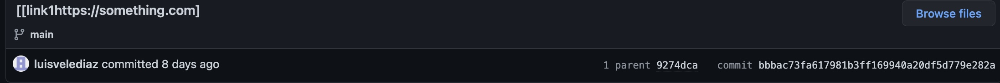

# Lab Report 2 

## 1st Code change

* This is the [test file](https://github.com/dfchang149/markdown-parser/commit/627d6ee98784b45d1cc0340b304bcc43e414f4ec) that broke the original code using extra brackets and parantheses.

* The resulting symptom of this broken file is an infinite loop.

* In order to resolve this symptom this is the changes made to the method.

* The bug in this case is the code not recognizing when the actual link begins. The symptom shown here is the result of an infinite loop in the terminal. The file input was designed to trick the code by adding extra `[]` and `()` to the name of the link.

## 2nd Code Change
* This is the [second test file](https://github.com/luisvelediaz/markdown-parser/commit/bbbac73fa617981b3ff169940a20df5d779e282a) that broke the code using less symbols that resemble a link.

* The resulting symptom of this broken file is the `[]` being added to the link. 

* These are two examples of the symptom happening one at the commit and the terminal.

* The failing file was fixed by the code changes below.

* The bug in this case was that the code read the text as a link but it is not suppose to be one. The code sees the `[` and `)` so it thinks that it contains a link. The symptom is caused by the bug in the code not catching on to the wrong answer because there was not suppose to be anything printed. 

## 3rd Code Change

* The [third test file](https://github.com/adhithiganesan/markdown-parser/commit/2130bb497840a1f2ca8d8ef2328a0b9b4aca1627) that broke the code was using an image link. 

* The resulting symptom was that the output was wrong and had an extra link. 

* The failing file was then fixed with the code changes below

* The bug in this case was that the code did not know whether the link was an image link or a web link, because their syntax is so similar and only distinguished with a "!". The test file purposely puts two normal links and an image link to see if the code would behave in the right way. The wrong output symptom is the result of the code incorrectly assuming the image link was a web link. 

[back](https://bchoucsd.github.io/cse15l-lab-reports/)